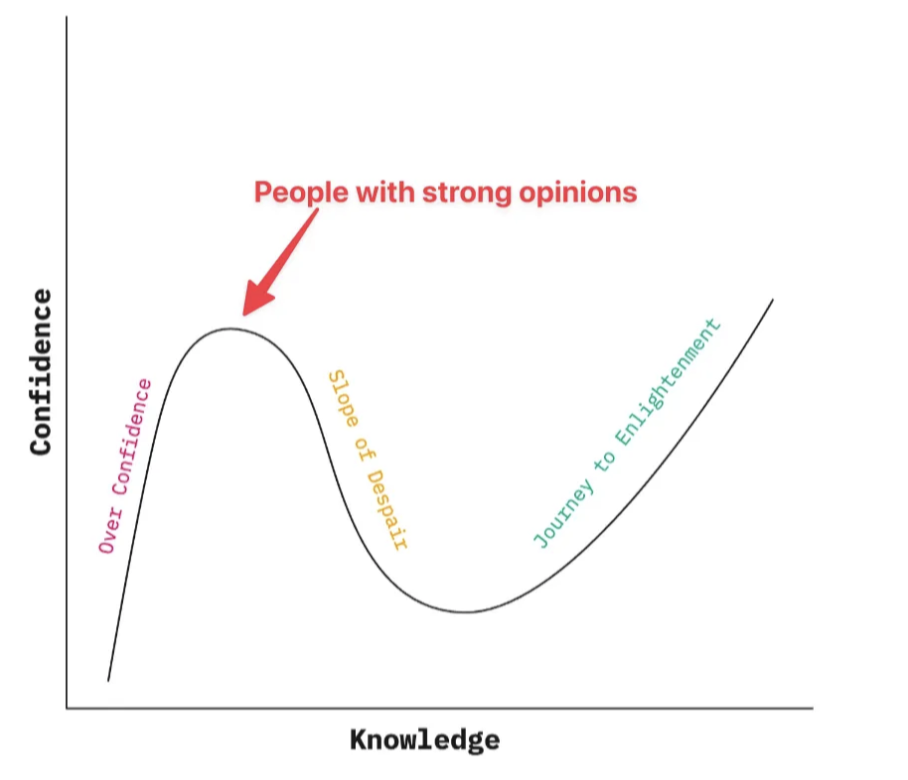

Ever notice how leading experts in science often give cautious, reserved answers? That’s because they understand the nuances and complexities of their field, leading to the famous but unexciting response: 'it depends.’ In software development, I’ve found that people with strong opinions often fall into two categories: they’re either at the peak of the Dunning-Kruger curve or they just love to argue

That said, I’d like to present an opinion that has developed over the course of my career as a software developer: I am not a fan of highly **opinionated frameworks.**..

An **opinionated framework** typically exhibits the following characteristics:

- It enforces a specific way to structure your code~~.~~
- It comes with many built-in features, often referred to as "batteries included”.
- It abstracts away boilerplate code.

Examples of opinionated frameworks include Angular, Django, and Ember, which provide strong conventions and tools that help maintain consistency but limit flexibility in how you can structure applications.

Opinionated frameworks aren’t all bad. In fact, they can be the reliable, albeit slightly bossy, teammate we didn’t know we needed. Sure, they have a strict way of doing things, but sometimes that’s exactly what helps keep the codebase from turning into spaghetti. Here are some reasons why some developers actually _like_ being told what to do.

- Opinionated Establishing strong patterns makes it easy for everyone on the team to read and write code.
- Consistent use of patterns simplifies onboarding to new codebases that share the same patterns as developers can quickly understand the structure and flow.
- The "batteries included" philosophy can be a great advantage. With built-in features, you can rely on the framework or language to provide many of the tools you need, reducing the time spent on setup.
- Getting started is fast, as a well-structured environment allows developers to focus on solving problems rather than configuring the project.
- Minimal boilerplate code helps keep the codebase clean and efficient, avoiding unnecessary complexity.

While there are plenty of upsides, that 'reliable, bossy teammate' can sometimes morph into the micromanaging colleague who won’t let you color outside the lines. Let’s dig into the drawbacks of these frameworks and why they might not be everyone’s cup of tea.

All the benefits I listed quickly fade when you're not familiar with the framework. It can result in a steep learning curve for new members, because they have to learn the new framework before they can begin to understand the domain from the code.

The argument for consistent use of patterns across codebases also has a downside: it discourages teams from exploring other technologies. The cost of getting developers up to speed with a \<insert-large-framework>, can quickly turn into a sunk cost fallacy. Even when future projects have vastly different requirements that don't align well with \<insert-large-framework>, teams may stick with it simply because they've already invested time and resources in learning it.

Relying too heavily on any framework or external dependency can be a risky move. Opinionated frameworks lock your code into a “marriage” with a third party, meaning you lose a certain degree of freedom and end up somewhat at the mercy of that framework. This power dynamic becomes painfully clear whenever the framework’s creators roll out a major breaking update. The industry is full of such cautionary tales: the legendary Angular.js to Angular rewrite, the shift from React Classes to Hooks, and the ASP.NET to ASP.NET Core overhaul, just to name a few.

I’ve witnessed one of these upgrade odysseys firsthand. I was on a team that got stuck on a early Ember version. The business focused on tackling technical debt on the backend, the Ember frontend upgrade kept getting delayed. By the time they circled back to it, upgrading had become a monumental task.

The team successfully migrated from a ancient version of Ember to an "just" an old version of Ember, but in the process, all their tests broke. To make matters worse, migrating to the latest version turned out to be an even bigger challenge. In the end, the team resigned themselves to using the old version of Ember —without any working unit tests, and no plan to upgrade, because the business required their attention elsewhere.

Frameworks, in general, aim to tackle common problems for you, freeing up your time to focus on the core domain logic. How many problems a framework solves is often tied to how opinionated it is. This is because well-defined constraints allow for generic solutions. But while generic code can be powerful, it’s often harder to read and reason about. For me, the tipping point where a framework shifts from a helpful tool to a stubborn constraint is when I lose the ability to understand what’s happening just by reading the code.
If I can’t see how a function is called or lose the ability to trace the code trail to understand how it works, the framework has become too opinionated. This kind of abstraction is often called _magic_—where the framework handles things “automatically,” but without fully revealing how it all works.

“How does this thing call that thing?”

“Oh, that’s just how it is. It’s <insert framework> _convention._ You just have to accept it.”

It reminds me of middle school when a student struggled to grasp a new math concept, and the teacher, unable to fully explain it, would just say, "That’s just how it is." Magic may feel cool when everything works smoothly. It can make you feel super productive in the short term. But let me tell you, it’s far from cool when things break. That once-cool "magic" quickly turns into a major headache.

But the constraints that opinionated frameworks impose can actually boost productivity. Starting from a blank slate can be overwhelming, and a little structure goes a long way. When I first started following the [conventional commits convention](https://www.conventionalcommits.org/en/v1.0.0/), writing commit messages suddenly got easier. With a set format, I didn’t have to overthink, and I ended up writing longer, more descriptive commits. This is probably the second-best argument for opinionated frameworks with strong conventions.

Personally, I feel that the Vue frontend framework hits the perfect balance between convention and flexibility. Vue’s [style guide](https://vuejs.org/style-guide/) includes patterns and anti-patterns, offering just enough structure to keep us productive while still allowing room to step outside the guidelines when needed. You can still follow sensible defaults and strong patterns without a frameworks forcing hand.

During a summer internship, I worked on a consulting project where a senior developer, known for their strong opinions, was part of the team. We were building a backend-for-frontend service using a minimal Kotlin framework called Http4k. Up until that point, my experience had been with large, feature-heavy frameworks, but Http4k was different. We followed a Domain Driven Design pattern and embraced the "Server as a Function" philosophy (you can check it out [here](https://www.youtube.com/watch?v=NjoCjupV8HE)).

The framework provided very little out of the box, and that was perfectly fine. Each initial slice of functionality was simple. We passed dependencies into the constructors of each class, and as the number of dependencies grew, we built a basic dependency service to handle them.

As the project evolved, so did its complexity and abstractions, but we only introduced them when necessary, taking the time to refactor and improve the code along the way. By the end of the summer, I understood every part of the codebase and knew exactly what problem each piece solved. Tackling complexity as it arose and solving problems as they emerged felt far more satisfying than blindly following a large framework’s way of doing things without fully understanding the “why” behind it or the specific issues it was meant to solve.

James Shore argues against the “buy vs build” dilemma in a blogpost of his that hits the nail on the head:

> _Every line of code in your system adds to your maintenance burden, and third-party code adds more to your maintenance burden than well-designed and tested code your company builds itself._
>
> _Ay, there’s the rub. I’m assuming competence. That includes having more than one person who understands the code. (If your company isn’t competent, well, you know what you need to do.)_
>
> - _Your code is designed to handle the specific narrow case you care about. Third-party code is generic, making it harder to understand and use. Often, much harder._
> - _Your code is updated on your schedule, and is built to integrate with the rest of your code. Third-party code is updated on others’ whims, and can break your existing code. Security-critical upgrades can result in “dependency hell:” cascading incompatibilities requiring you to drop everything as you scramble to make everything work together again._
> - _There’s usually someone you can ask about how your code works. Third-party maintainers may not be interested in answering support requests, and you’ll be lucky if the documentation covers every obscure edge case._
> - *Your code is maintained by full-time professionals. It’s as high-quality and secure as your company cares to invest.4 Third-party code is often maintained by part-time volunteers and students. It’s subject to* *[catastrophic](https://www.ftc.gov/policy/advocacy-research/tech-at-ftc/2022/01/ftc-warns-companies-remediate-log4j-security-vulnerability)* *[security](https://www.benjaminfleischer.com/2013/03/20/yaml-and-security-in-ruby/)* *[holes](https://spring.io/blog/2022/03/31/spring-framework-rce-early-announcement)\_\_,* *[fits of pique](https://www.theregister.com/2016/03/23/npm_left_pad_chaos/)\_\_, and* *[[solarwindssupplychainattackexplaine]]\_\_.*
>
> *If it’s not, you’re doing it wrong. Build exactly what you need, and no more. Then* *[evolve it](https://www.jamesshore.com/v2/books/aoad2/design)* *as your needs change.*
>
> _There’s that rub again. But if your company isn’t willing to pay for security of your code, there’s no way they’re going to pay to properly secure third-party code._
>
> _Sometimes these costs are worth it! But it’s not the clean, simple, “only build core competencies” people would have you believe. Third-party code is expensive. Even when it’s free. (**[https://www.jamesshore.com/v2/blog/2023/the-problem-with-dependency-injection-frameworks](https://www.jamesshore.com/v2/blog/2023/the-problem-with-dependency-injection-frameworks)**)_

Wrapping up this post with on a less objective note; I often feel that my solution space for a given problem shrinks considerably when working in an opinionated framework. Instead of asking, "How should I best solve this problem?" the question shifts to, "How should I solve this problem within the constraints of this framework?"

The challenge of the first question relies entirely on my computer science skills, and my knowledge of the core technologies I am working with. But with the second, my ability to solve the problem becomes dependent not just on those skills, but also on my familiarity with the framework. Core CS theory, common software patterns, and core technology understanding, are skills that last, and have a high chance of being usefule 10 years from now. Frameworks change, and get replaced, so deep framework knowledge has an expiration date.

What I love most about my job is the freedom to solve problems, iterate on solutions, think critically about patterns, and ensure that my solution fits well with the rest of the codebase. With an opinionated framework, the "right" way to do things is already decided for you. Instead of solving problems creatively, I end up Googling things like "How do I do \<insert task> in \<insert-framework>."

The "one right way" philosophy of opinionated frameworks can be a strength for some, but for me, it just makes the process feel boring. In the end, every tool has its trade-offs. Opinionated frameworks can offer speed and consistency but often at the cost of flexibility and understanding. For me, solving problems from the ground up, with full visibility into my code, beats having a framework do the thinking for me. Every project is different, and sometimes it's worth trading 'magic' for the freedom to craft solutions tailored to your needs.
